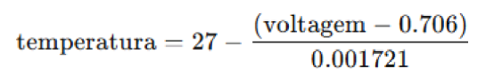

# Controle de Temperatura e Média Estatística  

## Descrição do Projeto  
Este projeto implementa um sistema de monitoramento de temperatura utilizando um microcontrolador  
baseado no RP2040, como o Raspberry Pi Pico. O sistema lê a temperatura ambiente, exibe os valores em  
um display OLED SSD1306 e aciona LEDs para indicar diferentes faixas de temperatura. Além disso, mantém  
um histórico de medições e calcula a média das últimas 10 leituras.  

---

## 1. Componentes e Hardware Utilizados  

- **Microcontrolador:** Raspberry Pi Pico (RP2040)  
- **Sensor de Temperatura Interno:** ADC do RP2040  
- **Display:** OLED SSD1306 (via comunicação I2C)  
- **LEDs Indicadores:**  
  - **LED Verde (GPIO 11):** Indica temperatura normal  
  - **LED Vermelho (GPIO 13):** Indica temperatura elevada  
- **Conexões I2C:**  
  - **SDA:** GPIO 14  
  - **SCL:** GPIO 15  

---

## 2. Funcionalidades Implementadas  

### a) Inicialização do Sistema  
1. Configuração do GPIO para os LEDs indicadores.  
2. Configuração do ADC para leitura da temperatura do sensor interno do RP2040.  
3. Configuração da comunicação I2C para controle do display OLED SSD1306.  
4. Exibição da mensagem inicial `"MONITORAMENTO TEMPERATURA"` no display.  

### b) Contagem Regressiva  
- O sistema exibe uma contagem regressiva no display de **10 a 0** antes de iniciar as medições.  
- Após a contagem regressiva, exibe a temperatura atual e a média das últimas leituras.  

### c) Leitura e Processamento da Temperatura  
1. O sistema realiza leituras periódicas da temperatura interna do RP2040 usando o ADC.  
2. A voltagem do ADC é convertida em temperatura pela fórmula fornecida no datasheet do RP2040.  

    

3. A leitura é armazenada em um histórico circular com 10 valores.  

### d) Cálculo da Média  
- A média das últimas 10 temperaturas é calculada somando os valores armazenados e dividindo pelo número de amostras.  

### e) Exibição das Informações no Display OLED  
- Exibe:  
  - `"Temperatura: XX.XX C"`  
  - `"Média: XX.XX C"`  

### f) Indicação Visual com LEDs  
- **Se a temperatura for maior ou igual a 35°C**, o LED vermelho acende e o LED verde apaga.  
- **Se a temperatura for menor que 35°C**, o LED verde acende e o LED vermelho apaga.  

---

## 3. Fluxo do Código  

1. **Inicialização:** Configura GPIOs, ADC, I2C e o display OLED.  
2. **Mensagem Inicial:** Exibe `"MONITORAMENTO TEMPERATURA"` por 5 segundos.  
3. **Contagem Regressiva:** Exibe números de **10 a 0** no display.  
4. **Loop Infinito:**  
   - Leitura da temperatura do ADC.  
   - Armazena no histórico para cálculo da média.  
   - Calcula a média das últimas 10 temperaturas.  
   - Exibe temperatura e média no display OLED.  
   - Aciona LEDs conforme a faixa de temperatura.  

---

## 4. Conclusão  
Este projeto fornece uma solução funcional para monitoramento de temperatura com um microcontrolador RP2040, utilizando o sensor interno. A exibição em um display OLED e o acionamento de LEDs permitem uma interface intuitiva e eficiente para o usuário. Com possíveis expansões, o sistema pode ser utilizado em aplicações como monitoramento ambiental e controle térmico de equipamentos.  
